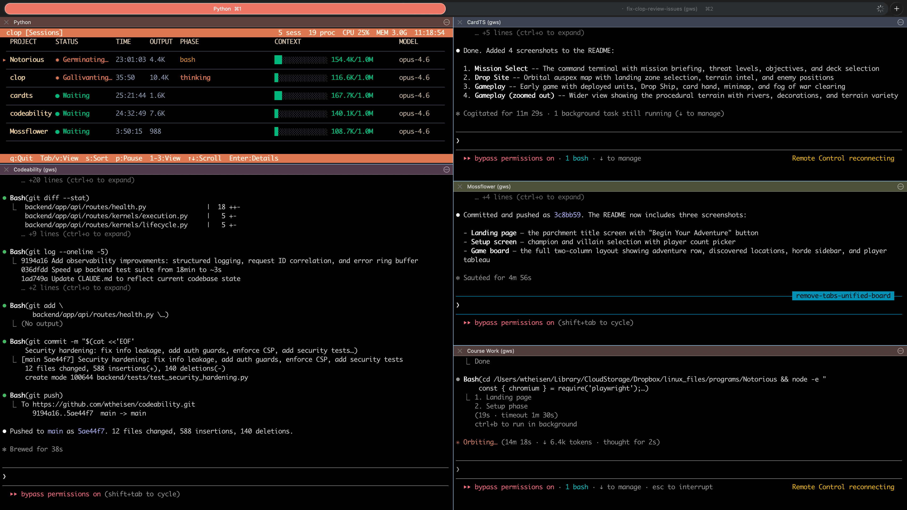
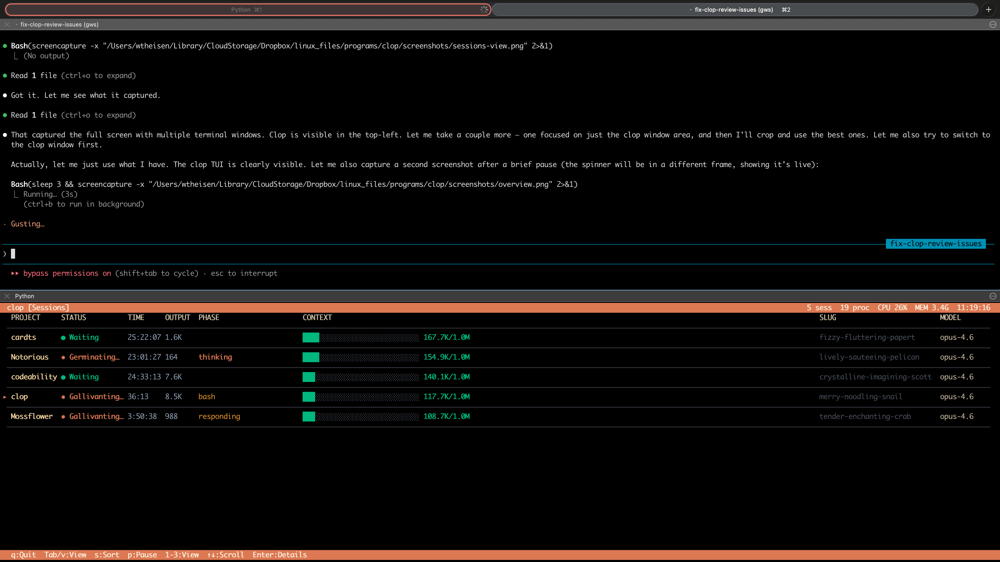

# clop

A `top`-like TUI for monitoring [Claude Code](https://docs.anthropic.com/en/docs/claude-code) sessions and processes in real time.






## Features

### Sessions View
- Live status for every active Claude Code session (thinking, responding, running tools, waiting, etc.)
- Animated spinner with Claude-style fun status words (Pondering, Ruminating, Clauding, ...)
- Aligned columns: PROJECT, STATUS, TIME, OUTPUT, PHASE, CONTEXT, SLUG, MODEL
- Context window usage bar with color-coded fill (green/amber/red)
- Select a session with Enter/Space to expand details (message count, tool calls, PID, memory, permission mode, subagents)
- Auto-sort: sessions waiting for input float to the top
- Cursor indicator (`▸`) shows current selection

### Processes View
- All Claude-related OS processes (Claude Code, MCP servers, Node workers)
- CPU%, MEM%, RSS, thread count, uptime, PPID
- Process type classification (Code, MCP, Node, Other)

### History View
- Lifetime stats: total sessions, messages, first session date
- Model usage breakdown: input/output/cache tokens per model
- 14-day daily activity chart with bar graph

### General
- Anthropic brand color palette (terracotta, beige, amber) with graceful 8-color fallback
- Sortable columns: activity, context%, tokens, messages, time (press `s` to cycle)
- Keyboard-driven: Tab/1-2-3 to switch views, arrows to scroll, Enter to expand, `p` to pause
- Efficient tail-read of JSONL conversation files (reads last 512KB, not the whole file)
- Auto-refreshing data every 2 seconds with 80ms render loop for smooth animation
- SLUG and MODEL columns gracefully hide on narrow terminals, CONTEXT always visible

## Requirements

- Python 3.8+
- [psutil](https://pypi.org/project/psutil/)
- A terminal with Unicode support (256-color recommended)

## Install

```bash
pip install psutil
```

Clone and run directly — `clop` is a single self-contained script:

```bash
git clone https://github.com/wtheisen/clop.git
cd clop
./clop
```

Or copy it anywhere on your `$PATH`:

```bash
cp clop /usr/local/bin/clop
```

## Usage

```
./clop
```

### Keybindings

| Key | Action |
|---|---|
| `q` | Quit |
| `Tab` / `v` | Cycle views |
| `1` `2` `3` | Jump to Sessions / Processes / History |
| `s` | Cycle sort column |
| `p` | Pause / resume |
| `Up` / `Down` | Move cursor |
| `Enter` / `Space` | Expand / collapse session details |
| `Home` | Jump to top |

## How It Works

`clop` reads from `~/.claude/` — the same directory Claude Code uses to store session metadata, conversation JSONL logs, and usage stats. It does not interact with the Anthropic API or modify any files. Everything is read-only and local.

## License

MIT
